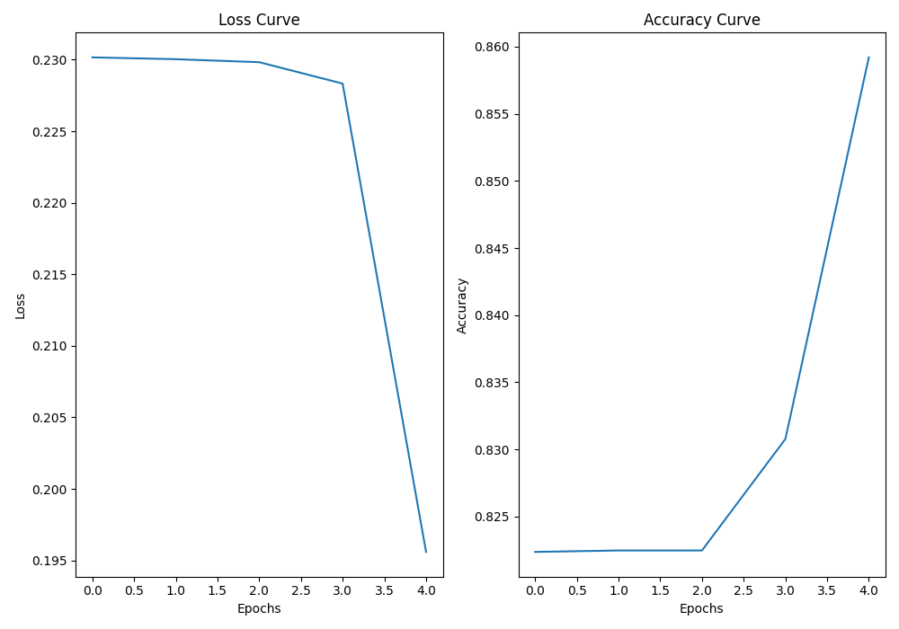

# numnet

A simple and concise implementation of feedforward neural networks in NumPy.

## Features

- Completed typed and documented codebase that designed to be easy to read, use, and understand.
- A functional-based library with no classes to focus on the basic functions and manipulations needed to train a neural network.
- Supports arbritrarily deep and wide feedforward neural networks.
- Supports a registry system for adding new activation and loss functions to quickly add complexity to the system.
  - Currently has `linear`, `relu`, `sigmoid`, `softmax` activations and `mse`, `binary_crossentropy`, `categorical_crossentropy` losses.
- Can be used for regression, binary classification, and multi-class classification problem.

## Usage

### Structures

The main object structure that needs to be understood in `numnet` is `Architecture`, which defines the `Network`. An `Architecture` is a list of dictionaries, where each list element defines a layer of the network. Each dictionary must satisfy the following format:

```python
layer = {"input_shape": nin, "output_shape": nout, "weight_init": 1.0, "activation": "linear"}
```

where `nin` and `nout` are the input and output shapes of the layer, `weight_init` is the scaling factor for the layer's weight initialization, and `activation` is function used to active the output of the layer.

It's important to note that the `input_shape` of the current layer and the `output_shape` of the previous layer must match.

The `Network` produced from a given architecture is similarly a list of dictionaries, where each dictionary has the format:

```python
layer = {"W": np.ndarray, "b": np.ndarray, "activation": "linear"}
```

where `W` has shape `(nin, nout)` and `b` has shape `(nout,)`.

### Functions

There are only four functions that are at the core of `numnet`:

1. `initialize`: create a `Network` given an `Architecture`.
2. `forward`: computes `Network` output given an input array.
3. `backward`: computes `Network` parameter gradients given loss gradient.
4. `update`: modifies `Network` parameters given gradients.

### Typical training loop

A skeleton training loop would look as follows:

```python
def train(architecture, X, y, alpha, epochs):
    # Initialize network with the given architecture
    network = initialize(architecture)
    # Main training loop
    for e in range(epochs):
        # Perform forward pass
        o, cache = forward(network, X)
        # Compute loss, specific to problem
        loss, grad = loss_fn(y, o)
        # Perform backward pass
        gradients = backward(network, grad, cache)
        # Update network parameters
        network = update(network, gradients, alpha)
```

## Examples

Concrete examples of how to use `numnet` can be found in `examples/`.

Below are the training curves for each of the three example files, covering the three problem classes that are supported by `numnet`.

### XOR


### Regression


### MNIST


